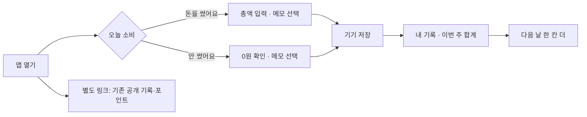

# savelog 이용 분석과 제품 전환

## 결론

현재 제품은 소셜 참여가 있어야 효용이 생기는데, 그 참여가 발생하기 전에 가입·공개 기록·평가받기를 요구한다. 기능이나 장식이 부족해서 안 쓴다는 증거는 없다. **혼자서 얻는 효용을 첫 기록에 제공하지 못하는 구조**가 가장 우선해서 바꿀 가설이다.

새 기본 경험은 **로그인 없이 시작하는 개인 소비 체크**다. 돈을 쓴 날과 안 쓴 날을 동등하게 기록하고, 저장 직후 자기 일주일을 확인한다. 공개 소셜 경험과 기존 포인트는 별도 공간으로 보존한다.

이는 데이터와 화면 검토에 근거한 제품 가설이다. 사용자의 실제 이탈 동기를 인터뷰로 확인한 결론이나, 개선 효과가 입증된 실험 결과는 아니다.

## 확인한 데이터

2026-09-08 KST, Supabase REST 15개 테이블을 읽기 전용으로 조회했다. 페이지별 총 건수를 확인하여 끝까지 조회했으며 운영 데이터에 쓰기는 하지 않았다. 재현: `python3 scripts/analyze_usage.py`. 저장 산출물은 집계만 포함하고 식별자·메모·인증정보는 포함하지 않는다.

정의:

- 가입자는 **현재 users 테이블의 연동 계정**이다. 전체 방문자나 역대 가입자 수가 아니다.
- 기록 작성자는 테스트 ID 접두사를 제외하고, `social-`·`milestone-` 게시물을 제외한 소비 기록의 작성자다. 운영자 본인 여부를 확정할 수 없어 별도로 제외하지 않았다.
- 자동 요정 ID `__fairy__`는 사람 반응과 활동자에서 제외했다.
- 재방문은 앱 실행 로그가 없어 **기록을 남긴 날짜**로만 측정한다. 조회만 한 사람은 관찰되지 않는다.
- 테스트 여부를 ID로 식별할 수 없는 계정은 남아 있을 수 있다. 표본도 작다.
- 작성자 수는 ID 단위다. 과거 익명 ID와 연동 ID가 같은 사람인지 완전히 복원할 수 없어 실인원 중복 가능성이 있다.

| 지표 | 관측값 | 해석 |
|---|---:|---|
| 현재 연동 계정 | 81명 | 방문자 수 아님 |
| 연동 계정 중 소비 기록 존재 | 17/81, 21.0% | 동일 ID 집합 대조 |
| 연동 계정 중 소비 기록 없음 | 64/81, 79.0% | 기록 전환 누수 |
| 전체 소비 기록 작성자 | 29명 | 연동 계정과 불일치하는 ID 12명 포함 |
| 두 번 이상 작성 | 7/29, 24.1% | 같은 날 추가 작성 포함 |
| 다른 날에도 작성 | 6/29, 20.7% | 반복 사용 부족 |
| 첫 기록 다음 날 다시 기록 | 4/29, 13.8% | D1 기록 리텐션 |
| 첫 기록 7일 후 다시 기록 | 1/29, 3.4% | D7 정확 일자, 7일 이내와 다름 |
| 첫 기록 30일 후 다시 기록 | 0/25 | 관찰 기간 충족자만 분모 |
| 소비 기록 | 66건 | 원본 74 → 테스트 제외 69 → 소셜·마일스톤 제외 66 |
| 0원 소비 기록 | 47/66, 71.2% | 간단한 무지출 체크 수요 |
| 지킨 돈 금액을 입력한 기록 | 0건 | 기능 투자를 정당화할 관측 없음 |
| 텍스트 길이 중앙값 | 10자 | 긴 글보다 짧은 기록 |
| 상위 두 작성자의 기록 | 28/66, 42.4% | 극소수 의존 |
| 마지막 소비 기록 | 2026-08-25 | 최근 기록 단절 |

| 월 | 소비 기록 | 작성자 | 신규 연동 계정 |
|---|---:|---:|---:|
| 2026-06 | 52 | 19 | 36 |
| 2026-07 | 7 | 7 | 33 |
| 2026-08 | 7 | 5 | 10 |
| 2026-09, 8일 오전까지 | 0 | 0 | 2 |

최근 30일(8/10~9/8) 소비 기록은 7건·작성자 5명. 최근 7일 소비 기록은 0건이다. 같은 기간 사람의 쓰기 활동은 각각 6명·1명이므로 **기록 0건을 방문 0명으로 해석하면 안 된다.** 월 신규 연동 감소 역시 노출 감소인지 클릭률 하락인지 알 수 없다.

이전 8/20 메모리의 '77명 중 작성자 26명'과 '미작성 63명(82%)'은 서로 일치하지 않는다. 연동/익명 ID 범위 혼용 가능성이 있어 과거 수치는 그대로 재사용하지 않는다. 이번에는 연동 계정과 작성자 집합을 교집합으로 대조했다. 과거 비율과 직접적인 증감 비교는 하지 않는다.

## 왜 사용하지 않는가

| 판단 | 증거 | 확신·한계 | 이번 변경 |
|---|---|---|---|
| 첫 효용 전에 가입을 요구한다 | production App의 로그인 조기 반환, 64/81 미작성 | 화면 구조는 확정. 로그인 자체 이탈률은 미측정 | 개인 기록은 로그인 없이 가능 |
| 새 방문자에게 설명조차 잘못 나온다 | 닉네임은 자동 생성되는데 `isMigration = !!nickname`; 신규도 '기록과 포인트를 잃지 않게' 안내 | 코드에서 확정한 결함 | 이전 공간의 분기를 실제 기존 key/기록 여부로 수정 |
| 소셜 효용이 먼저 필요하지만 공급이 없다 | 최근 30일 7건, 듀오 0, 커뮤니티 글 총 2 | 공급 부족은 확정. 개인 이탈 원인의 크기는 미측정 | 초기 화면에서 공개 피드·판정·서클 제거 |
| 반복 사용의 이유가 타인의 반응에 달려 있다 | 요정 제외 첫 기록 24시간 내 사람 판정 10명 중 다른 날 작성 3명, 미판정 19명 중 3명 | 30.0% vs 15.8%; 소표본·관찰 연구·시간 순서 및 사용자 성향 교란. 인과 효과 아님 | 즉시 보상은 실제 내 기록과 주간 누적 |
| 사용자는 짧게 체크하고 싶어 한다 | 71%가 0원, 글 중앙값 10자, 지킨 돈 0건 | 기록한 사람에게만 관측됨. 미작성자의 선호로 일반화 금지 | 소비 여부 → 금액, 메모는 선택 |
| 소비 기록을 평가받는 일이 부담일 수 있다 | '자백', '진짜야?', '판정'을 중심에 둔 현재 카피 | 미검증 심리 가설. 사용자 발언을 확보하지 못함 | 공개·평가 제거, 쓴 날도 중립적인 확인 |
| 화면에 선택지가 많아 시작이 흐려진다 | 작성·오늘의 토크·필터 5종·서클·피드·3탭이 첫 화면에서 경쟁 | 휴리스틱 판단. 클릭맵 없음 | 개인 첫 화면은 두 가지 소비 상태와 한 주 |
| 유입 부족도 독립적인 문제다 | 월 신규 연동 36→33→10→9월 현재 2 | 노출/클릭/진입 이벤트가 없어 유입 원인 확정 불가 | 첫 행동 계측 추가, 별도 유입 검증 계획 |

외부 근거는 savelog 사용자의 진술을 대체하지 않는다. 로그인 전에 효용을 보여주는 접근은 [NN/g의 로그인 장벽 연구](https://www.nngroup.com/articles/login-walls/), 빈 화면에서 핵심 작업으로 직접 연결하는 방식은 [NN/g의 빈 상태 설계 지침](https://www.nngroup.com/articles/empty-state-interface-design/)과도 일치한다.

## 검토한 대안

| 대안 | 채택 여부 | 이유 |
|---|---|---|
| 소셜 피드 디자인만 개선 | 제외 | 콘텐츠 공급·반복 사용 문제를 그대로 둠 |
| AI 판정과 댓글 확대 | 제외 | 자동 반응을 더 만드는 것이 사람의 재사용을 늘린다는 증거 없음 |
| 살까말까 결정 도구로 전환 | 보류 | 차별화 가능하지만 현재 해당 기능 이용 근거가 없음 |
| 계좌 자동 연동 가계부 | 보류 | 새 연동·동의·정합성 비용이 크고 현재 관측은 짧은 수기 기록 중심 |
| 개인 소비 체크를 기본으로 | 구현 | 실제 쓰인 행동을 확장하고 네트워크 규모 의존성을 제거 |

개인 기록 앱 역시 반복 사용이 보장되지 않는다. 다음 검증에서도 재기록이 낮으면 화면을 더 꾸미기보다 이 사용 목적 자체를 재검토한다.

## 구현한 경험

소비 여부를 기본 선택하지 않는다. 빈 입력을 0원으로 저장하지 않는다. 무지출은 2회 탭으로 기록 가능하며 지출은 총액 입력이 추가된다. 날짜별 1건이며 추가 소비는 해당 날짜의 총액을 수정한다. 미기록 날짜는 0원·실패·절약으로 계산하지 않는다. 새 기록에는 포인트를 약속하지 않는다.

새 데이터는 공개 Supabase 테이블에 쓰지 않는다. `savelog_personal_journal_v1`에만 저장하고, 기존 키·공개 기록·잔여 포인트를 유지한다. 자동 클라우드 백업은 제공하지 않는다. 백업 내보내기/가져오기와 파일 저장 미지원 시 복사 가능한 백업 본문을 제공한다. 동일 날짜 복원 시 현재 기록을 우선한다. 실제 토스 웹뷰의 파일 저장은 별도 실기기 확인 대상이다.

TDS·Supabase·기존 CSS는 이전 공간에 들어갈 때만 로드한다. 신규 첫 화면의 코드와 데이터 요청을 줄인다. 기존 `/feed`, `/mylog`, `/community`, 초대 파라미터 링크는 이전 경험을 유지한다.

## 효과를 판단하는 방법

새 이벤트는 `journal_open`, `journal_record_start`, `journal_record_saved`, `journal_record_failed`, `journal_history_open`, `journal_backup_export`, `journal_backup_import`, `journal_legacy_open`이다. `experience=personal_v1`, `kind=zero|spend`, `action=create|edit`, `has_history`만 필요한 경우 붙인다. 금액·메모·날짜·앱 자체 계정 ID를 넣지 않는다. 플랫폼 SDK는 자체 익명 키를 붙일 수 있다. 지원하지 않는 환경이나 전송 실패는 기록 저장을 막지 않는다.

성공 기준은 아래 **사전 운영 목표**이며 업계 평균이나 예상 개선율이 아니다.

- 신규 첫 진입 50명 이상에서 첫 기록 완료 40% 이상을 첫 판단 기준으로 둔다. 기존 21%는 '연동 계정' 분모라 직접 A/B 비교하지 않는다.
- 첫 기록자 30명 이상이 7일 관찰 기간을 채우면, 7일 안에 다른 날 기록한 비율 30%를 판단 기준으로 둔다. 정확 D7도 별도로 본다.
- 저장 실패율과 기존 기능 진입/오류를 함께 확인한다. 화면 변경 전후 다른 유입 집단은 분리한다.
- 2~4주 안에 표본이 안 쌓이면 새 기능을 붙이지 않고 유입을 먼저 점검한다. 토스 콘솔 노출→상세→실행 숫자를 확보하고 한 유입 채널·한 메시지로 초기 모집한다.
- 실패/중단 사용자 5명에게 '처음 무엇을 기대했는지', '마지막에 멈춘 화면', '지금 대신 무엇을 쓰는지'를 직접 묻는다. 이번 작업에서 연락은 발송하지 않았다.
- 이벤트 총 건수를 사람 수로 나누지 않는다. 플랫폼 익명 사용자 단위 중복 제거 및 기간 충족 조건이 필요하다. 단말 저장 초기화는 `has_history`를 초기화하므로 신규/재방문 분류에 한계가 있다.

## 남아 있는 한계

2026-09-08 콘솔 업로드를 완료했고 배포 조회 상태는 `CREATED`다. 검토 요청·공개 출시는 실행하지 않았으며 실제 사용자 행동 개선은 미검증이다. 상세는 [배포 기록](../deployments/2026-09-08-personal-checkin.md)을 참조한다. 기존 공개 서비스의 인증·RLS를 전면 재설계한 작업도 아니다. 따라서 공개 테이블에 새로운 비공개 데이터를 넣거나 계정 연동만으로 비공개 백업을 약속하지 않는다. UI가 유입을 만들어준다고 주장하지 않는다.

## 구현 검증 결과

2026-09-08, 브랜치 `feat/personal-checkin`에서 검증했다.

| 확인 | 결과 |
|---|---|
| TypeScript | `tsc -b` 통과 |
| 단위 테스트 | `npm test`에 해당하는 저장·날짜·복원 테스트 9개 통과 |
| 프로덕션 브라우저 | `npm run test:browser` 11개 시나리오 통과 |
| 저장 실패 | quota 초과·기존 데이터 손상 시 성공 표시/덮어쓰기 없음 |
| 데이터 구분 | 개인 흐름 최초 진입부터 저장·복원까지 Supabase 요청 0건 |
| 날짜 | 미국 시간대 브라우저에서 KST 기준 확인, 자정에 초안 날짜 보존, 과거 기록→오늘 복귀 |
| 백업 | 파일 다운로드·본문 복사 대안·중복 복원·잘못된 파일 거부 확인 |
| 레이아웃 | 320/390/1440px 가로 넘침 없음 |
| 기존 경험 | production 신규 로그인 안내, 이전 공간 진입·복귀 확인 |
| 정적 디자인 점검 | 검출 항목 없음. 이것만으로 시각 품질을 판정하지 않음 |
| 별도 화면 검토 | 탐색·문구·아이콘·방향 기록 관련 지적 4개 수정 확인, verdict `ship`은 해당 수정 항목 범위 |
| 빌드 | `npm run build` 성공, `.ait` 63개 엔트리, `sources/index.html` 및 최신 Root 청크 포함 |

신규 개인 화면 CSS 12.35KB, Root JS 17.04KB이며 React 진입 JS와 SDK 청크는 별도다. 이전 공간은 여전히 큰 1,250.32KB JS 청크라 Vite의 청크 경고가 남지만 개인 홈에서 불러오지 않는다. 이 수치는 산출물 크기이며 실기기 시작 시간 측정이 아니다.

재현 명령과 브라우저 의존 경로는 [README](../../README.md), 테스트 원문은 [저장 테스트](../../tests/journal.test.mjs)와 [브라우저 테스트](../../tests/journal.browser.mjs)에 있다. 로컬 화면 캡처는 `.impeccable/review/`에 저장했다. 실제 사용자 데이터는 테스트 화면에 넣지 않았다.
